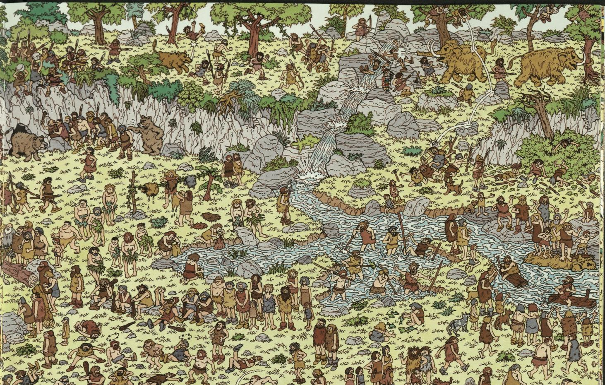
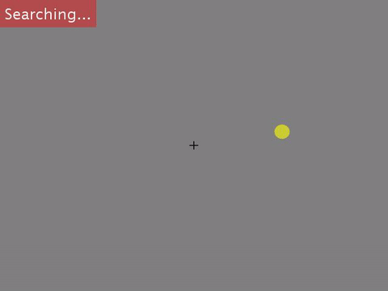
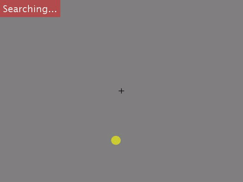
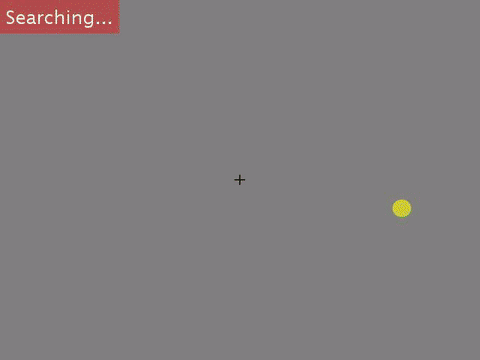
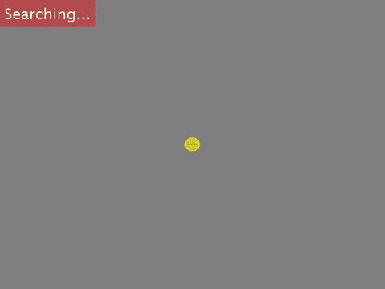

# Finding any Waldo: Zero-shot Invariant and Efficient Visual Search 

Authors: Mengmi Zhang, Jiashi Feng, Keng Teck Ma, Joo Hwee Lim, Qi Zhao, and Gabriel Kreiman

This repository contains an implementation of a zero-shot deep learning model for invariant and efficient visual search. Our paper is currently under review.

An unofficial copy of our manuscript can be provided upon request.

## Project Description

Searching for a target object in a cluttered scene constitutes a fundamental challenge in daily vision. Visual search must be selective enough to discriminate the target from distractors, invariant to changes in the appearance of the target, efficient to avoid exhaustive exploration of the image, and must generalize to locate novel target objects with zero-shot training. Previous work has focused on searching for perfect matches of a target after extensive category-specific training. Here we show for the first time that humans can efficiently and invariantly search for natural objects in complex scenes. To gain insight into the mechanisms that guide visual search, we propose a biologically inspired computational model that can selectively, invariantly and efficiently locate targets, generalizing to novel objects. The model provides an approximation to the mechanisms integrating bottom-up and top-down signals during search in natural scenes.


| [](sampleimg/cropped_2_1.jpg)  | [](sampleimg/waldo.JPG) |[](GIF/AM.gif)  | [](GIF/FP.gif) |
|:---:|:---:|:---:|:---:|
| Stimuli | Target | Attention Map predicted by our model | Fixated Place | 

## Pre-requisite

The code has been successfully tested in MAC OSX and Ubuntu 14.04. Only CPU is required. To speed up computation, GPU is highly recommended (3GB GPU memory at least). 

It requires the deep learning platform Torch7. Refer to [link](http://torch.ch/docs/getting-started.html) for installation.  

Matio package is required (save and load matlab arrays from Torch7). Refer to [link](https://github.com/soumith/matio-ffi.torch) for installation.

Loadcaffe package is required (load pre-trained caffe model to Torch7). Refer to [link](https://github.com/szagoruyko/loadcaffe) for installation.

Run the commands:
```
luarocks install image
luarocks install tds
```
Download our repository:
```
git clone https://github.com/kreimanlab/VisualSearchZeroShot.git
```

Download the caffe VGG16 model from [HERE](https://drive.google.com/open?id=1AEJse0liaT8uJoLmImqhyJN2y2_6mDsJ) and place it in folder /Models/caffevgg16/

## Usage

### Visual search in object arrays

Navigate to the repository folder. To run our search model, copy the following command in the command window:
```
th IVSNtopdown_30_31_array.lua
```
Visualize the generated attention map in MATLAB: visAttentionMap_array.m

### Visual search in natural images

Navigate to the repository folder and run PreprocessNaturalDesign.m in MATLAB

It preprocesses the search images by cropping it into uniform pieces and saving the paths of the cropped images in croppednaturaldesign_img.txt.

To run our search model, copy the following command in the command window:
```
th IVSNtopdown_30_31_naturaldesign.lua
```
Visualize the generated attention map in MATLAB: visAttentionMap_naturaldesign.m

### Visual search in Waldo images

Navigate to the repository folder and run PreprocessWaldoImage.m in MATLAB

It preprocesses the search images by cropping it into uniform pieces and saving the paths of the cropped images in croppednaturaldesign_img.txt.

To run our search model, copy the following command in the command window:
```
th IVSNtopdown_30_31_waldo.lua
```
Visualize the generated attention map in MATLAB: visAttentionMap_waldo.m

## Datasets

We have collected human eyetracking data in three increasingly complex visual search tasks: object arrays, natural images and Waldo images. Below are the preview of example trial in each task. Yellow circles denote the eye movements. Red bounding box denotes the ground truth. Correspondingly, we show the eye movement predicted by our computational model.

| [](GIF/array_6.gif)  | [](GIF/naturaldesign_21_subj1.gif) |[](GIF/waldo_31_subj1.gif)  |
|:---:|:---:|:---:|
| Object array (Human) | Natural image (Human) | Waldo image (Human) |

| [](GIF/array_6_model.gif)  | [](GIF/naturaldesign_21_model.gif) |[](GIF/waldo_31_model.gif)  |
|:---:|:---:|:---:|
| Object array (Model) | Natural image (Model) | Waldo image (Model) |

**Note** that we have one variation of the search task in object arrays. Instead of familiar objects, we create a dataset of **novel** object on arrays. See below for novel object examples:


You can **download** the complete dataset (size: 3GB) from [HERE](https://drive.google.com/open?id=19mZ759OlUca-WSodPbHRncnFTH02yi3i)

It contains the following:
- datasets: contain search images, targets, ground truth, psychophysics (human eyetracking data, MATLAB function to process and extract fixations)
- eval: contain MATLAB files to evaluate cummulative search performance as a function of number of fixations
- Plot: plot pre-processed results saved in .mat and reproduce some figures in the manuscript
- supportingFunc: add this directory in your MATLAB search path
   
## Notes

The source code is for illustration purpose only. Path reconfigurations may be needed to run some MATLAB scripts. We do not provide techinical supports but we would be happy to discuss about SCIENCE!

## License

See [Kreiman lab](http://klab.tch.harvard.edu/code/license_agreement.pdf) for license agreements before downloading and using our source codes and datasets.
